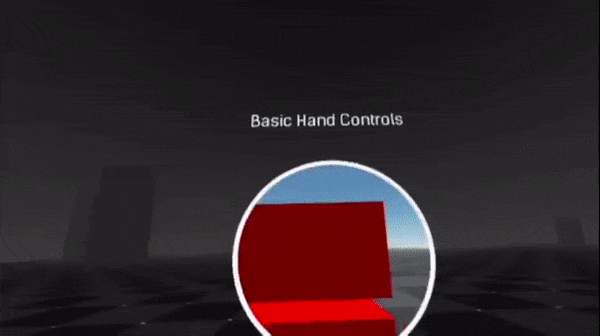
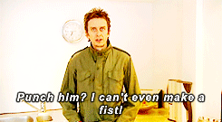
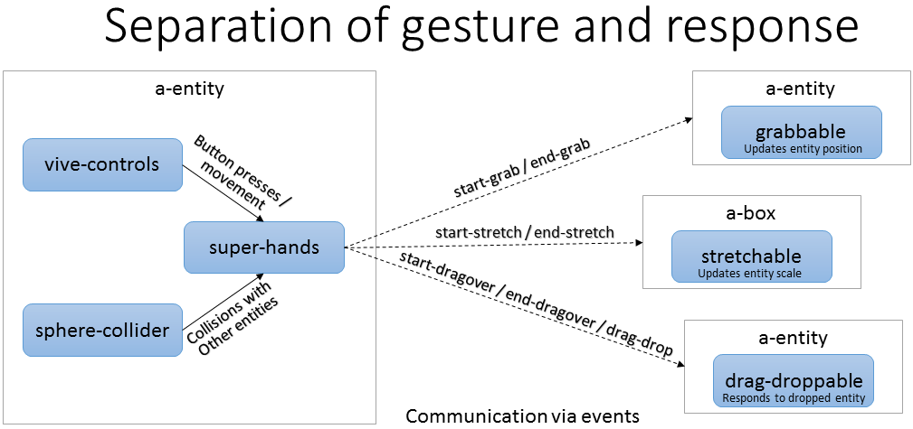

# Super Hands

[](https://travis-ci.com/wmurphyrd/aframe-super-hands-component)
[](https://www.npmjs.com/package/super-hands)
[](https://www.npmjs.com/package/super-hands)
[](https://standardjs.com)

Effortlessly add natural, intuitive interactions with tracked controller,
touch, or mouse input in [A-Frame](https://aframe.io).





## Introduction

The goal of `super-hands` is to make it easy to handle user input in
Web VR by providing a high-level API that is consistent across all devices.
Instead of dealing directly with controller button events, raycasters, and
collision detection components, you setup your scene and components instead
to respond to 'gestures' like hovering and grabbing.

The currently implemented gestures are:

* Hover: Holding a controller in the collision space of an entity or pointing at
  an entity with a cursor or laser pointer
* Grab: Pressing a button while hovering an entity, potentially also moving it
* Stretch: Grabbing an entity with two hands and resizing
* Drag-drop: Activating one entity and then gesturing to another entity to
  interact with it

### How to use super-hands

The family of components in this library fall into two categories:

**Core**: The `super-hands` component itself does the work of gathering
events from user input devices and collision detection components to
interpret them into gestures that it communicates out to the targeted
entities via custom events. This component is placed on the same entities
as your tracked controllers and/or your cursor raycaster.

**Reaction Components**: The `super-hands` core component alone only
communicates user intent via gesture events to the entities users want to
interact with; reaction components
enable the interactivity on those entities. This package includes components for
common reactions, `hoverable`, `clickable`, `grabbable`, `stretchable`,
`draggable`, and `droppable`, and it is also designed to be easily
extended with your own custom reaction components.

### Getting started

#### Browser

Install and use by directly by including the [browser files](dist):

```html
<head>
  <title>Most Basic Super-Hands Example</title>
  <script src="https://aframe.io/releases/1.4.0/aframe.min.js"></script>
  <script src="https://cdn.jsdelivr.net/gh/donmccurdy/aframe-extras@v6.1.1/dist/aframe-extras.misc.min.js"></script>
  <script src="https://unpkg.com/super-hands@^3.0.3/dist/super-hands.min.js"></script>
</head>

<body>
  <a-scene>
    <a-assets></a-assets>
    <a-entity>
      <a-camera></a-camera>
      <a-entity sphere-collider="objects: a-box" super-hands hand-controls="hand: left"></a-entity>
      <a-entity sphere-collider="objects: a-box" super-hands hand-controls="hand: right"></a-entity>
    </a-entity>
    <!-- hover & drag-drop won't have any obvious effect without some additional event handlers or components. See the examples page for more -->
    <a-box hoverable grabbable stretchable draggable droppable color="blue" position="0 0 -1"></a-box>
  </a-scene>
</body>
```

#### npm

Install via npm:

```bash
npm install super-hands
```

Then require and use.

```js
require('aframe');
require('super-hands');
```

## Readme contents:

* [Examples](#examples)
* [News](#news)
* [Compatibility](#compatibility)
* [Super Hands Core Component](#super-hands-component)
* [Reaction components](#reaction-components)
  * [`hoverable`](#hoverable-component)
  * [`grabbable`](#grabbable-component)
    * [`clickable`](#clickable-component)
  * [`stretchable`](#stretchable-component)
  * [`draggable`](#draggable-component)
  * [`droppable`](#droppable-component)
* [Customizing interactivity](#customizing-interactivity)

## Examples

The [examples page](https://wmurphyrd.github.io/aframe-super-hands-component/examples/) showcases a variety of configurations and use cases for `super-hands`.

| Example Scene | Description | Target VR Devices |
| --- | --- | --- |
| [Hand controllers with physics](https://wmurphyrd.github.io/aframe-super-hands-component/examples/#physics) | Grab, stretch, and drag-drop cubes with simulated physical behavior in roomscale VR | Vive, Rift, Windows MR |
| [Gaze and laser pointer controls without physics](https://wmurphyrd.github.io/aframe-super-hands-component/examples/#mouse) | Showcase fallback controls used for simpler VR devices and fallback interactivity without physics simulation | Desktop, mobile, cardboard, Gear VR, Daydream, Vive, Rift, Windows MR |

## News

v3.0.4
* A-Frame 1.4.0 support confirmation
  * Updated dependencies and fixed tests and examples
  * No API changes

[Previous news](news.md)

### Known Issues

* Two-handed physics grabs don't feel great
  * Help wanted with configuring ideal constraints for this situation
* `too much recursion` errors when using two raycasting controllers:
  When using raycasters,
  always set their `objects` property to prevent the raycasters from colliding
  with each other's lines.

## Compatibility

With the right configuration, `super-hands` can provide interactive controls
for any device: desktop, mobile ("magic window"), cardboard viewer + button,
3DOF (Daydream, GearVR) and full 6DOF tracked controls (Vive, Oculus Touch, Valve Index, et c).

`super-hands` dependency version compatibility:

| super-hands Version | A-Frame Version | aframe-extras Version | @c-frame/aframe-physics-system Version |
| --- | --- | --- | --- |
| ^v3.0.4 | ^v1.4.0 | ^v6.1.1 | ^v4.1.0 |
| ^v3.0.3 | ^v1.3.0 | ^v6.1.1 | ^v4.1.0 |
| ^v3.0.2 | ^v1.0.4 | ^v6.1.1 | ^v4.0.1 |
| v3.0.0 | ^v0.8.2 | ^v4.1.2 | ^v3.1.2 |

## Core Component

### super-hands component

The `super-hands` component is the core of the library.
It communicates gesture events to entities based on
user-input and entity collisions. The component is generally placed on
the controller entities (or the camera for gaze interaction) and depends on
a collision detection component (e.g. `raycaster`, [aframe-extras sphere-collider](https://github.com/donmccurdy/aframe-extras/blob/master/src/misc),
of [aframe-physics-extras physics-collider](https://github.com/wmurphyrd/aframe-physics-extras))
which needs to be placed on the same entity or a child entity of `super-hands`.

#### Component Schema

| Property | Description | Default Value |
| -------- | ----------- | ------------- |
| colliderEvent | Event that your chosen collider emits when identifying a new collision | `'hit'` |
| colliderEventProperty | Name of property in event `detail` object which contains the collided entity | `'el'` |
| colliderEndEvent | Event that your chosen collider emits when a collision ends | `'hitEnd'` |
| colliderEndEventProperty | Name of property in event `detail` object which contains the un-collided entity | `'el'` |
| grabStartButtons | Array of button event types that can initiate grab | Button press, touch start, and mouse down events |
| grabEndButtons | Array of button event types that can terminate grab | Button release, touch end, and mouse up events |
| stretchStartButtons | Array of button event types that can initiate stretch | Button press, touch start, and mouse down events |
| stretchEndButtons | Array of button event types that can terminate stretch | Button release, touch end, and mouse up events |
| dragDropStartButtons | Array of button event types that can initiate dragging/hovering | Button press, touch start, and mouse down events |
| dragDropEndButtons | Array of button event types that can execute drag-drop | Button release, touch end, and mouse up events |

Collider-related property defaults are set to work with `sphere-collider`.
Default button events include specific events for `vive-controls`,
`hand-controls`, `oculus-touch-controls`, `daydream-controls`,
`gearvr-controls`, `windows-motion-controls`, `oculus-go-controls`, mouse, and touch.

#### Gesture Events

Events will be emitted by the entity being interacted with.
The entity that `super-hands` is attached to is sent in the event `detail` as the property `hand`.

| Type | Description | Target |  detail object |
| --- | --- | --- | --- |
| hover-start | Collided with entity | collided entity | hand: `super-hands` entity |
| hover-end | No longer collided with entity | collided entity | hand: `super-hands` entity |
| grab-start | Button pressed while collided with entity and hand is empty | collided entity | hand: `super-hands` entity |
| grab-end | Button released after grab-start | collided entity | hand: `super-hands` entity |
| stretch-start | Both controllers have button pressed while collided with entity | collided entity | hand: `super-hands` entity, secondHand: second controller entity |
| stretch-end | Release of button after stretch-start | collided entity | hand: `super-hands` entity |
| drag-start | Drag-drop button pressed while collided with entity and hand is empty | collided entity | hand: `super-hands` entity |
| drag-end | Drag-drop button released while dragging an entity | dragged entity | hand: `super-hands` entity |
| dragover-start | Collision with entity while dragging another entity | collided entity & held entity | hand: `super-hands` entity, hovered: collided entity, carried: held entity |
| dragover-end | No longer collided with entity from dragover-start | collided entity & held entity | hand: `super-hands` entity, hovered: collided entity, carried: held entity |
| drag-drop | Button released while holding an entity and collided with another | collided entity & held entity | hand: `super-hands` entity, dropped: carried entity, on (carried entity only): receiving entity |

Notes:

* References to buttons being "released" and "pressed" are dependent on the schema settings.
* Only one entity at a time will be targeted for each event type,
even if multiple overlapping collision zones exist. `super-hands` tracks a
LIFO stack of collided entities and a nearest-first queue of raycasted Entities
to determine which will be affected.
* drag-drop: For the receiving entity, `on` entry in the detail is `null`.
If needed, use `event.target` instead.
* For events triggered by buttons, the triggering button event is passed
  along in `detail.buttonEvent`
* When entities are nested, gesture events will bubble to the closest parent
  with a related reaction component. This makes it easy to make specific
  hotspots on larger objects by making the child collidable
  but placing the reaction component on the parent
  (e.g., a door with the handle as a collidable child and a `grabable` parent
  door so the whole door moves only when the handle is grabbed). To prevent
  a gesture from bubbling, trap it on the child by giving it reaction components
  or listening-for and cancelling the gesture events
  (see [Gesture acceptance and rejection](#Gesture-acceptance-and-rejection]))

#### Global Event Handler Integration

In addition to the A-Frame style gesture events,
`super-hands` also causes standard HTML events analogous to VR
interactions to be emitted by the target entities. This allows the use of these
common Global Event Handler properties on entities to add reaction directly
in the HTML. View the
[related example](https://wmurphyrd.github.io/aframe-super-hands-component/examples/#events)
to see this in use.

| entity HTML attribute | conditions | event.relatedTarget |
| --- | --- | --- |
| onmouseover | hovering in an entity's collision zone | `super-hands` entity |
| onmouseout | leaving an entity's collision zone | `super-hands` entity |
| onmousedown | grab started while collided with entity | `super-hands` entity |
| onmouseup | grab ended while collided with entity | controller entity |
| onclick | grab started and then ended while collided with entity | controller entity |
| ondragstart | drag-drop started while collided with entity | controller entity |
| ondragend | drag-drop started while collided with entity | controller entity |
| ondragenter | hovering in an entity's collision zone while drag-dropping another entity | the other entity\* |
| ondragleave | leaving an entity's collision zone while drag-dropping another entity | the other entity\* |
| ondrop | drag-drop ended while holding an entity over a target | the other entity\* |

The event passed to the handler will be a `MouseEvent`. At present the only property implemented
is `relatedTarget`, which is set as
listed in the table. Drag-dropping events will be dispatched on both the entity being dragged and the drop target, and the `relatedTarget` property for each will point to the other entity in the interaction.

## Reaction Components

Add these components to entities in your scene to make them react to
super-hands gestures.

### hoverable component

Used to indicate when the controller is within range to interact with an entity
by adding the 'hovered' state.

#### States

| Name | Description |
| --- | --- |
| hovered | Added to entity while it is collided with the controller |


### grabbable component

Makes and entity move along with the controller's movement and rotation
while it is grabbed. `grabbable` works with
up-close grabbing (6DOF controllers like Vive and Oculus Touch
with `hand-controls` and `sphere-collider`)
and with pointing at a distance (3DOF controllers like GearVR and Daydream
with `laser-controls`).

This works best with [aframe-physics-system](https://github.com/donmccurdy/aframe-physics-system)
to manage grabbed entity movement including position and rotation,
but it will fallback to manual `position` updates
if physics is not available
or is disabled with `usePhysics = never`.

Allows for multiple hands to register a grab on an entity.
In a non-physics setup, this has no effect
other than allowing smooth passing of entities between hands.
With physics enabled, additional grabbing
hands register their own physics constraints to allow for
two-handed wielding of entities. Limit or disable this
by setting the maxGrabbers schema property.

#### Component Schema

| Property | Description | Default Value |
| -------- | ----------- | ------------- |
| startButtons | Which button events to accept to start grab | `[]` |
| endButtons | Which button events to accept to end grab | `[]` |
| usePhysics | Whether to use physics system constraints to handle movement, 'ifavailable', 'only', or 'never' | 'ifavailable' |
| maxGrabbers | Limit number of hands that can grab entity simultaneously | NaN (no limit) |
| invert | Reverse direction of entity movement compared to grabbing hand | false |
| suppressY | Allow movement only in the horizontal plane | false |

The default for `startButtons` and `endButtons` is to accept any button
recognized by `super-hands` `grabStartButtons` and `grabDropEndButtons`.

#### States

| Name | Description |
| --- | --- |
| grabbed | Added to entity while it is being carried |

### clickable component

An alternative version of `grabbable` that registers that a button was pressed, but does not
move the entity. Do not use `clickable` and `grabbable` on the same entity
(just use `grabbable` and watch the "grabbed" state instead of "clicked")

#### Component Schema

| Property | Description | Default Value |
| -------- | ----------- | ------------- |
| startButtons | Which button events to accept to start grab | `[]` |
| endButtons | Which button events to accept to end grab | `[]` |

The default for `startButtons` and `endButtons` is to accept any button
recognized by `super-hands` `grabStartButtons` and `grabDropEndButtons`.

#### States

| Name | Description |
| --- | --- |
| clicked | Added to entity while a button is held down |


### stretchable component

Makes and entity rescale while grabbed by both controllers as they are moved
closer together or further apart.

#### Component Schema

| Property | Description | Default Value |
| -------- | ----------- | ------------- |
| startButtons | Which button events to accept to start stretch | `[]` |
| endButtons | Which button events to accept to end stretch | `[]` |
| usePhysics | Whether to update physics body shapes with scale changes, 'ifavailable' or 'never' | 'ifavailable' |
| invert | Reverse the direction of scaling in relation to controller movement | `false` |
| phyicsUpdateRate | Milliseconds between each update to the physics bodies of a stretched entity | 100 |

The default for `startButtons` and `endButtons` is to accept any button
recognized by `super-hands` `stretchStartButtons` and `stretchEndButtons`.

There is no CANNON API method for updating physics body scale, but `stretchable`
will manually rescale shapes and offsets for stretched entity body and
all descendent entity bodies.
This update is throttled and will occur no more than once every
`physicsUpdateRate` milliseconds to improve performance. Set this to a smaller
number to increase the physics simulation fidelity.
Currently rescalable shapes are: box and sphere. At present, this rescaling
is only possible on when using the `'local'` physics driver. If using another
driver, setting `usePhysics: never` will avoid errors but also cause
loss of sync between stretched entities' appearance and behavior.  

#### States

| Name | Description |
| --- | --- |
| stretched | Added to entity while it is grabbed with two hands |

### draggable component

`draggable` makes an entity able to participate in a drag and drop
gesture with a `droppable` entity. This does not move an entity
(also add `grabbable` for that functionality), but instead tracks whether
a gesture has been made that involves pressing a button down with the controller
pointed at this entity, and then moving the controller to point at another
entity with the `droppable` component before releasing.

For interactivity, use the global event handler integration,
the `event-set` from [kframe](http://github.com/ngokevin/kframe)
with the `drag-drop` event, or create your own component.

#### Component Schema

| Property | Description | Default Value |
| -------- | ----------- | ------------- |
| startButtons | Which button events to accept to start drag | `[]` |
| endButtons | Which button events to accept to end drag | `[]` |

The default for `startButtons` and `endButtons` is to accept any button
recognized by `super-hands` `dragDropStartButtons` and `dragDropEndButtons`.

#### States

| Name | Description |
| --- | --- |
| dragged | Added to entity from button press until button release |

### droppable component

The `droppable` component sets an entity up as a target to respond to
`dragged` entities. Optionally, it can be configured to accept only
specific entities and to emit custom events on acceptance or rejection.

Combining the `accepts` and `acceptEvent` property of `droppable` with
`event-set` from [kframe](http://github.com/ngokevin/kframe), you can
create rich interactivity without any additional JavaScript or
custom components.

#### Component Schema

| Property | Description | Default Value |
| -------- | ----------- | ------------- |
| accepts | CSS query string to specify which entities to respond to | `''` (accept all entities) |
| autoUpdate | Should it watch for newly added entities that match `accepts`? May impact performance. | `true` |
| acceptEvent | String. Name of custom event to emit upon successful drag-drop interaction | `''` (don't emit event) |
| rejectEvent | String. Name of custom event to emit upon rejecting attempted drag-drop that contained an entity not included in `accepts` | `''` (don't emit event) |

Accept and reject events will contain the dragged entity that was accepted/rejected
in the `el` property of `detail`.

#### States

| Name | Description |
| --- | --- |
| dragover | Added to the entity while a controller is holding an acceptable `draggable` entity in the collision space of the `droppable` entity |


## Customizing interactivity

### Gesture and Response Concept



Separating the reaction to be the responsibility of the entity affected allows for extensibility.
In response to a grab, you may want some entities to lock to the controller and move,
others to rotate around a fixed point, and others still to spawn a new entity but remain unchanged.
With this API schema, these options can be handled by adding or creating different reaction
components to the entities in your scene, and `super-hands` can work with all of them.

### Interactivity

There are two pathways to adding additional interactivity.

1. A-Frame style: Each component's API documentation describes the A-Frame
custom events and states it uses.
These can be used on conjunction with other community A-Frame components
or by creating custom  components for your project that register
event listeners and react accordingly.
1. HTML style: The `super-hands` component also integrates with the
Global Event Handlers Web API to trigger standard mouse events analogous
to the VR interactions that can easily be handled through
properties like `onclick`.

### Gesture acceptance and rejection

Entities which are the target of gestures communicate back to `super-hands`
that they have accepted the attempted interaction by 'cancelling' the
gesture event (i.e. calling `.preventDefault()` on the event). This allows
`super-hands` to penetrate overlapping and nested entities in order to find
the desired target and for reaction components to be discriminating about
their conditions for interaction
(e.g., [`droppable`](#droppable)). All of the provided
reaction components handle this signaling automatically, but, if you
create your own reaction components, it is important to cancel the events when
responding to a gesture so that `super-hands` knows the gesture has been
accepted and stops searching for a viable target.
